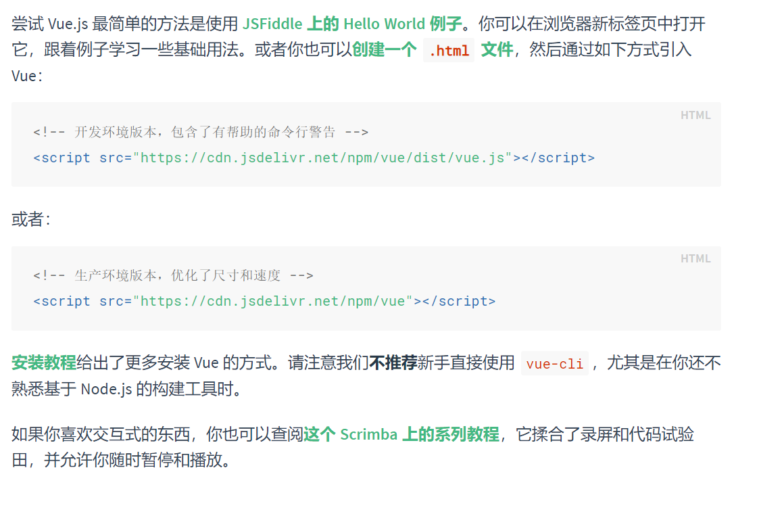

## 第一个 vue 程序

### 查看官网教程

通过查看 [官网](https://cn.vuejs.org/v2/guide/) 的起步教程， 开启编写第一个 vue 程序：



### 动手撸代码

1. 导入开发版本的 Vue.js
2. 创建 Vue 对象实例， 设置 el 属性和 data 属性
3. 使用简洁的模板语法把数据渲染到页面上

```html
<!DOCTYPE html>
<html lang="en">

<head>
    <meta charset="utf-8">
    <title>vue 基础</title>
    <!-- 开发环境版本，包含了有帮助的命令行警告 -->
    <script src="https://cdn.jsdelivr.net/npm/vue/dist/vue.js"></script>
</head>

<body>

    <div id="app">
        {{ message }}
    </div>
    <script>
        var app = new Vue({
            el: "#app",
            data: {
                message: "hello vue!"
            }
        })
    </script>
</body>
</html>
```

