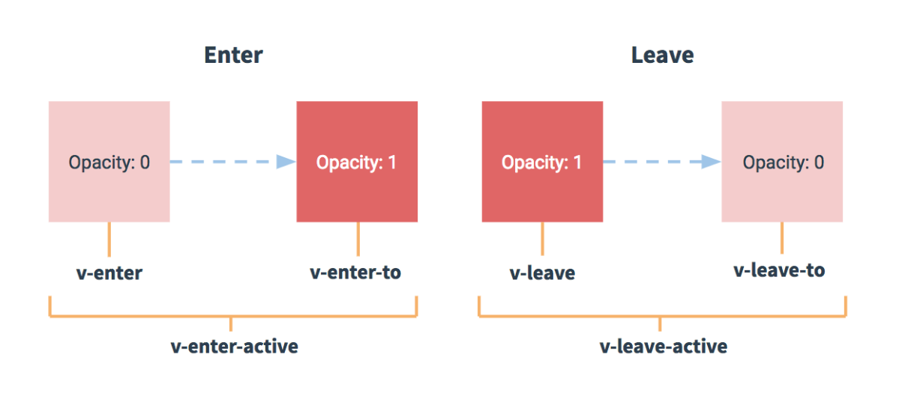

## 过渡 transition（需要学习相关 css 基础知识）

### 概念

1. vue 通过操作 css 的 transition 或 animotion 可以给特定的目标元素添加/移除特定的 class
2. 官网教程：https://cn.vuejs.org/v2/guide/transitions.html


### 过渡的类名

在进入/离开的过渡中，会有 6 个 class 切换。

1. `v-enter`：定义进入过渡的开始状态。在元素被插入之前生效，在元素被插入之后的下一帧移除。
2. `v-enter-active`：定义进入过渡生效时的状态。在整个进入过渡的阶段中应用，在元素被插入之前生效，在过渡/动画完成之后移除。这个类可以被用来定义进入过渡的过程时间，延迟和曲线函数。
3. `v-enter-to`: **2.1.8版及以上** 定义进入过渡的结束状态。在元素被插入之后下一帧生效 (与此同时 `v-enter` 被移除)，在过渡/动画完成之后移除。
4. `v-leave`: 定义离开过渡的开始状态。在离开过渡被触发时立刻生效，下一帧被移除。
5. `v-leave-active`：定义离开过渡生效时的状态。在整个离开过渡的阶段中应用，在离开过渡被触发时立刻生效，在过渡/动画完成之后移除。这个类可以被用来定义离开过渡的过程时间，延迟和曲线函数。
6. `v-leave-to`: **2.1.8版及以上** 定义离开过渡的结束状态。在离开过渡被触发之后下一帧生效 (与此同时 `v-leave` 被删除)，在过渡/动画完成之后移除。




### 使用

1. 在目标元素外包裹

   ```vue
   <transition name="fade">
       <div :class="{box:isShow}" v-if="isShow">Transition</div>
   </transition>
   ```

2. 定义 class 样式

   ```css
   .fade-enter,
   .fade-leave-to{
       opacity: 0;
       /* transform: translateX(200px) scale(3); */
       transform: translateX(200px);
   }
   
   .fade-enter-active,
   .fade-leave-active {
       transition: all 2s ease-in-out;
   }
   ```
   
   


### 过渡组件 demo

```vue
<template>
    <div>
      <h3>Transition</h3>
      <button @click="isShow = !isShow"> 动画切换 </button>
      <!-- 增加过渡 transition -->
      <transition name="fade">
        <div :class="{box:isShow}" v-if="isShow">Transition</div>
      </transition>
    </div>
</template>

<script>
export default {
  name: 'TransitionTest',
  data () {
    return {
      isShow: false
    }
  }
}
</script>

<style scoped>
    .box{
        width: 200px;
        height: 200px;
        background-color: red;
        color: #fff;
        font-size: 20px;
        display: flex;
        justify-content: center;
        align-items: center;
    }

    .fade-enter,
    .fade-leave-to{
        opacity: 0;
        /* transform: translateX(200px) scale(3); */
        transform: translateX(200px);
    }

    .fade-enter-active,
    .fade-leave-active {
        transition: all 2s ease-in-out;
    }
</style>
```


