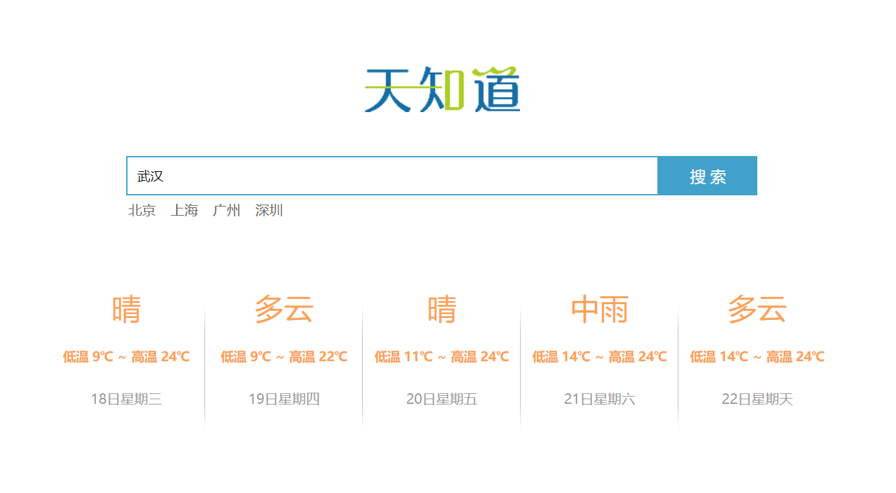

## 天气预报应用

### 功能

1. 回车查询：
   1. 按下回车：@keyup.enter
   
   2. 查询数据：axios    v-model
   
   3. 渲染数据：v-for    that
   
      ```html
      <li v-for="item in weatherList">
          <div class="info_type"><span class="iconfont">{{ item.type }}</span></div>
          <div class="info_temp">
              <b>{{ item.low }}</b>
              ~
              <b>{{ item.high }}</b>
          </div>
          <div class="info_date"><span>{{ item.date }}</span></div>
      </li>
      ```
   
2. 点击查询：

   1. 点击城市：@click

   2. 查询数据：使用已有逻辑（this.method）

      ```js
      clickSeach: function(city){
          this.city = city;
          this.queryWeather();
      }
      ```

   3. 渲染数据：已存在


### 天气接口

1. 请求地址：http://wthrcdn.etouch.cn/weather_mini
2. 请求方式：get
3. 请求参数：city （查询的城市名，string 类型）
4. 响应内容：天气信息


### 总结

1. 应用的逻辑代码建议和页面分离，使用单独的 js 文件编写
2. axios 回调函数中 this 指向改变了，需要额外的保存一份
3. 服务器返回的数据比较复杂时，获取的时候需要注意层级结构
4. methods 中定义的方法内部，可以通过 this 关键字点出其它的方法


### 演示效果




### demo

```html
<!DOCTYPE html>
<html lang="en">
<head>
    <meta charset="utf-8">
    <title>天气预报应用</title>
    <!-- 开发环境版本，包含了有帮助的命令行警告 -->
    <script src="https://cdn.jsdelivr.net/npm/vue/dist/vue.js"></script>
    <!-- axios 开发库 -->
    <script src="https://unpkg.com/axios/dist/axios.min.js"></script>
    <!-- 导入 css 样式 -->
    <link rel="stylesheet" href="css/reset.css" />
    <link rel="stylesheet" href="css/index.css" />
</head>

<body>
    <div class="wrap" id="app">
        <div class="search_form">
          <div class="logo"></div>
          <div class="form_group">
            <input type="text" v-model="city"  @keyup.enter="queryWeather"   class="input_txt" placeholder="请输入查询的天气"/>
            <button class="input_sub" @click="queryWeather">
              搜 索
            </button>
          </div>
          <div class="hotkey">
            <!-- <a href="javascript:;">北京</a>
            <a href="javascript:;">上海</a>
            <a href="javascript:;">广州</a> -->
            <a href="javascript:;" v-for="city in hotCitys" @click="clickSeach(city)">{{ city }}</a>
          </div>
        </div>
        <ul class="weather_list">
          <li v-for="item in weatherList">
            <div class="info_type"><span class="iconfont">{{ item.type }}</span></div>
            <div class="info_temp">
              <b>{{ item.low }}</b>
              ~
              <b>{{ item.high }}</b>
            </div>
            <div class="info_date"><span>{{ item.date }}</span></div>
          </li>
        </ul>
      </div>
    <script>
        var app = new Vue({
            el: "#app",
            data: {
                city:"武汉",
                weatherList:[],
                hotCitys:["北京", "上海", "广州", "深圳"]
            },
            methods: {
                queryWeather: function(){
                    var that = this;
                    axios.get("http://wthrcdn.etouch.cn/weather_mini?city=" + this.city)
                    .then(function(response){
                        that.weatherList = response.data.data.forecast;
                    }, function(error){
                        console.log(error)
                    })
                },
                clickSeach: function(city){
                    this.city = city;
                    this.queryWeather();
                }
            }
        })
    </script>
</body>
</html>
```

