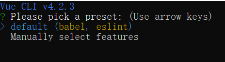
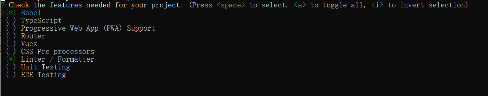
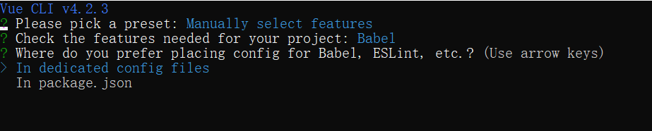
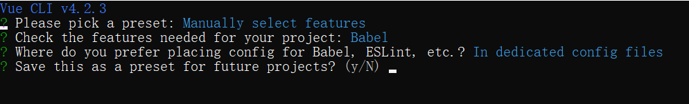

## 环境

### 安装 node.js 

下载地址：https://nodejs.org/zh-cn/

### 安装 vue-cli

vue-cli 是 vue 官方提供的脚手架工具，默认搭建好了一个项目的基本架子，我们在基础上进行相应修改即可

全局安装：npm install -g @vue/cli

### 初始化vue项目

创建 vue 项目：vue create project_demo

创建时的一些选项：

1. Please pick a preset?

   

   - default

   - Manually select features：手动配置，空格是选中或取消，A 键是全选

     

     - Babel：高阶语法转换，方便打包运行

     - TypeScript：支持使用 TypeScript 书写源码（react 会涉及到）

     - Progressive Web App （PWA）Support

       PWA 不是 api 或技术，但它是一种 Web 开发方法，它使用已有的工具和技术组合来创建有针对性的理想用户体验

     - Router：支持 vue-router（多页面开发需要配置多路由）

     - Vuex：支持 vuex

     - CSS Pre-processors：支持 css 预处理器

     - Linter / Formatter：支持代码风格检查和格式化

     - Unit Testing：支持单元测试

     - E2E Testing：支持 E2E 测试

     选择完成后会有提示：Check the features needed for your project: Babel  （简单的开发，只选择第一个）

2. Where do you prefer placing config for Babel, ESLint,   etc. ?  (Use arrow keys) 你更喜欢将Babel, ESLint等的配置放在哪里?

   

   - In dedicated config files：放在底层
   - In package.json：放在明面上

3. Save this as a preset for future projects? 是否保留到后边的项目配置？选择不保留 N

   

4. 配置完成之后，等待初始化完成即可

