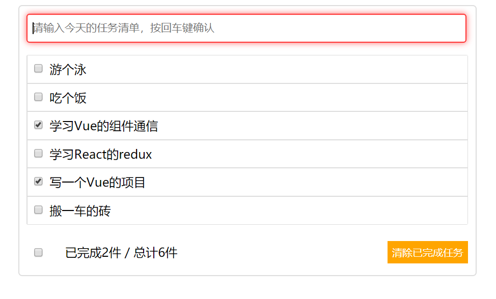
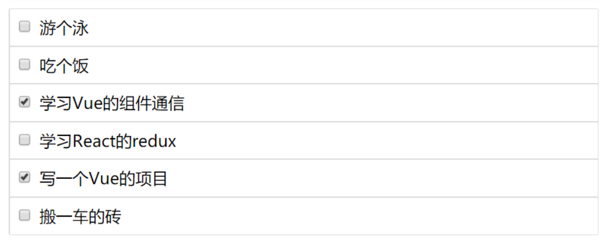
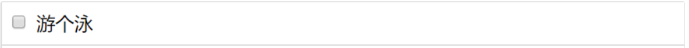
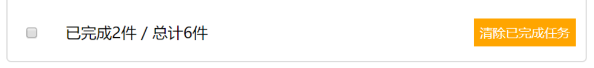

## TODOList

### 知识点

1. 界面展示全部放在 App.vue 组件中，使用 props 向子组件传递【数据[todos]，增加，删除，选中】方法，然后子组件使用父组件的方法，并传递相关参数完成方法调用，最终改变父组件中的页面内容


### 效果展示



### 组件拆分

1. Header.vue

   

2. List.vue

   

3. Item.vue

   

4. Footer.vue

   


### 组件 demo

App.vue

```vue
<template>
  <div id="app" class="todo-container">
    <div class="todo-container">
        <div class="todo-wrap">
            <!-- props 方法 -->
            <!-- <Header :addTodo="addTodo"/> -->
            <!-- 自定义事件方法 -->
            <!-- <Header @addItem="addTodo"/> -->
            <!-- 自定义事件方法2，挂载完成之后再监听 -->
            <Header ref="header"/>
            <List :todos="todos" :delTodo="delTodo"/>
            <Footer :todos="todos" :selectedAllTodo="selectedAllTodo" :delFinishedTodos="delFinishedTodos"/>
        </div>
    </div>
  </div>
</template>

<script>
// 引入组件
// TODOList
import Header from './components/TODOList/Header'
import Item from './components/TODOList/Item'
import List from './components/TODOList/List'
import Footer from './components/TODOList/Footer'

export default {
  name: 'App',
  // 注册组件
  components: {
    Header,
    Item,
    List,
    Footer
  },
  data () {
    return {
      todos: [
        {title: '学习Vue的组件通信', finished: true},
        {title: '学习React的redux', finished: false},
        {title: '写一个Vue的项目', finished: true},
        {title: '搬一车的砖', finished: false}
      ]
    }
  },
  // 监听子组件的事件
  mounted () {
    this.$refs.header.$on('addItem', this.addTodo)
  },
  methods: {
    // 插入一条数据
    addTodo (todo) {
      this.todos.unshift(todo)
    },
    // 根据索引删除一条记录
    delTodo (index) {
      this.todos.splice(index, 1)
    },
    // 是否选中所有的任务
    selectedAllTodo (isCheck) {
      this.todos.forEach(todo => {
        todo.finished = isCheck
      })
    },
    delFinishedTodos () {
      this.todos = this.todos.filter(todo => !todo.finished)
    }
  }
}
</script>

<style>
/* TODOList */
    .todo-container {
        width: 600px;
        margin: 0 auto;
    }

    .todo-container .todo-wrap {
        padding: 10px;
        border: 1px solid #ddd;
        border-radius: 5px;
    }
</style>
```


Header.vue

```vue
<template>
  <div class="todo-header">
    <input type="text" placeholder="请输入今天的任务清单，按回车键确认" v-model="title" @keyup.enter="addItem" />
  </div>
</template>

<script>
export default {
  name: 'Header',
  props: {
    addTodo: Function
  },
  data () {
    return {
      title: ''
    }
  },
  methods: {
    addItem () {
      // 1. 判断是否为空
      const title = this.title.trim()
      if (!title) {
        alert('输入的任务不能为空！')
        return
      }
      // 2. 生成一个todo对象
      let todo = { title: title, finished: false }
      // 3. 调用父组件的插入方法
      // this.addTodo(todo)
      // 自定义事件的方法
      this.$emit('addItem', todo)
      // 4. 清空输入框
      this.title = ''
    }
  }
}
</script>

<style scoped>
.todo-header input {
  width: 560px;
  height: 28px;
  font-size: 14px;
  border: 1px solid #ccc;
  border-radius: 4px;
  padding: 4px 7px;
  outline: none;
}

.todo-header input:focus {
  outline: none;
  border-color: rgba(255, 0, 0, 0.8);
  box-shadow: inset 0 1px 1px rgba(255, 0, 0, 0.075),
    0 0 8px rgba(255, 0, 0, 0.6);
}
</style>

```


List.vue

```vue
<template>
  <ul class="todo-main">
      <Item v-for="(todo, index) in todos"  :key='index' :todo="todo" :index="index" :delTodo="delTodo" />
  </ul>
</template>

<script>
import Item from './Item'
export default {
  name: 'List',
  props: {
    todos: Array,
    delTodo: Function
  },
  components: {
    Item
  }
}
</script>

<style scoped>
.todo-main {
  margin-left: 0px;
  border: 1px solid #ddd;
  border-radius: 2px;
  padding: 0px;
}

.todo-empty {
  height: 40px;
  line-height: 40px;
  border: 1px solid #ddd;
  border-radius: 2px;
  padding-left: 5px;
  margin-top: 10px;
}
</style>
```


Item.vue

```vue
<template>
  <li
    @mouseenter="dealShow(true)"
    @mouseleave="dealShow(false)"
    :style="{backgroundColor: bgColor}"
  >
    <label>
      <input type="checkbox" v-model="todo.finished" />
      <span>{{todo.title}}</span>
    </label>
    <button v-show="isShowDelButton" class="btn btn-warning" @click="delItem">删除</button>
  </li>
</template>

<script>
export default {
  name: 'Item',
  props: {
    todo: Object,
    index: Number, // 当前任务在总任务数组中的下标位置
    delTodo: Function
  },
  data () {
    return {
      isShowDelButton: false, // false 隐藏 true 显示
      bgColor: '#fff'
    }
  },
  methods: {
    dealShow (isShow) {
      // 控制按钮的显示和隐藏
      this.isShowDelButton = isShow
      // 控制背景颜色
      this.bgColor = isShow ? '#ddd' : '#fff'
    },

    delItem () {
      if (window.confirm(`您确定删除 ${this.todo.title} 吗?`)) {
        this.delTodo(this.index)
      }
    }
  }
}
</script>

<style scoped>
li {
  list-style: none;
  height: 36px;
  line-height: 36px;
  padding: 0 5px;
  border-bottom: 1px solid #ddd;
}

li label {
  float: left;
  cursor: pointer;
}

li label li input {
  vertical-align: middle;
  margin-right: 6px;
  position: relative;
  top: -1px;
}

li button {
  padding: 4px 10px;
  float: right;
  margin: 5px;
  border: none;
  background-color: red;
  color: #fff;
}

li:before {
  content: initial;
}

li:last-child {
  border-bottom: none;
}
</style>
```


Footer.vue

```vue
<template>
  <div class="todo-footer">
    <label>
      <input type="checkbox" v-model="isCheck" />
    </label>
    <span>
      <span>已完成{{finishedCount}}件</span>
      / 总计{{todos.length}}件
    </span>
    <button class="btn btn-warning" @click="delFinishedTodos">清除已完成任务</button>
  </div>
</template>

<script>
export default {
  name: 'Footer',
  props: {
    todos: Array,
    selectedAllTodo: Function,
    delFinishedTodos: Function
  },
  computed: {
    finishedCount () {
      return this.todos.reduce(
        (total, todo) => total + (todo.finished ? 1 : 0),
        0
      )
    },
    isCheck: {
      get () {
        return (
          this.finishedCount === this.todos.length && this.todos.length > 0
        )
      },
      set (value) {
        this.selectedAllTodo(value)
      }
    }
  }
}
</script>

<style scoped>
.todo-footer {
  height: 40px;
  line-height: 40px;
  padding-left: 6px;
  margin-top: 5px;
}

.todo-footer label {
  display: inline-block;
  margin-right: 20px;
  cursor: pointer;
}

.todo-footer label input {
  position: relative;
  top: -1px;
  vertical-align: middle;
}

.todo-footer button {
  float: right;
  margin-top: 5px;
  padding: 6px;
  border: none;
  background-color: orange;
  color: #fff;
}
</style>
```


###### 完 ~